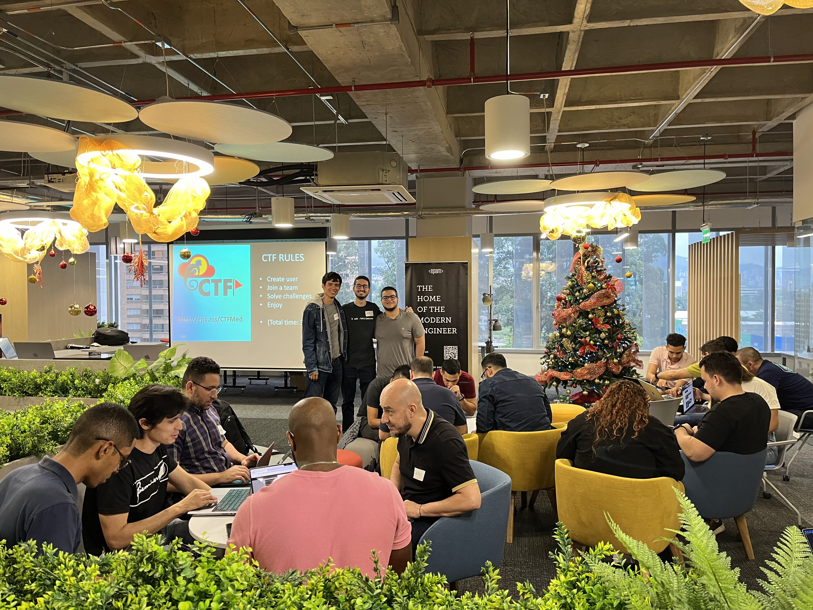
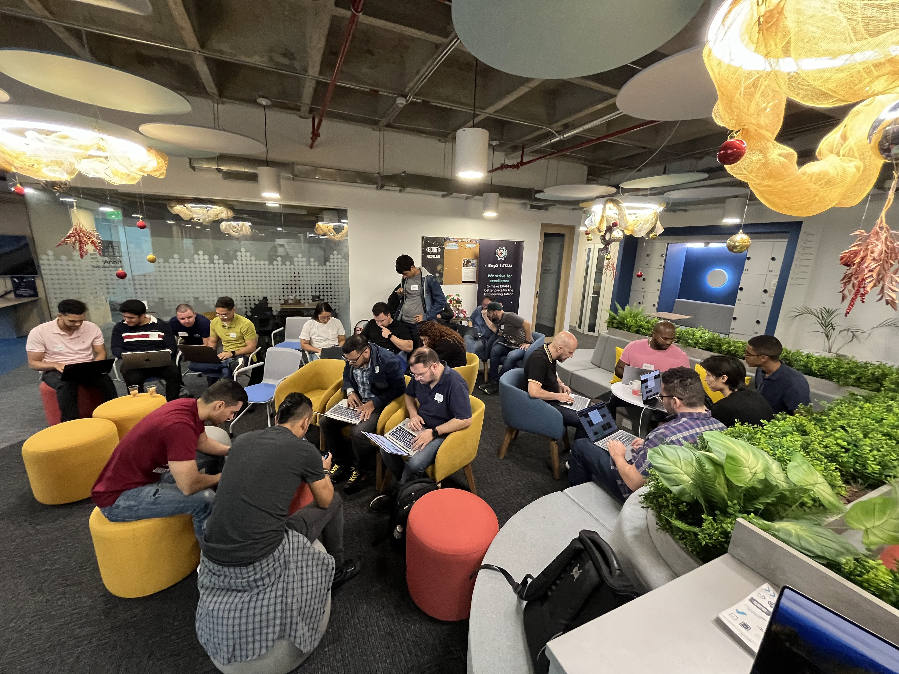

# 🏁 AWS-CDK-CTF 🏁

Custom hosting and creation of an exciting Capture The Flag (CTF) event, showcasing compelling Cloud and DevOps challenges tailored for the AWS CloudCrafters LATAM Community. <br>

## Event Pictures 💥

Here are some images when hosting the live event:


<br>

<br>

<br>

## Summary/Overview :memo:

- Deployed on AWS with Infrastructure as Code on [CDK-TypeScript](https://aws.amazon.com/cdk/).
- Implemented custom CTFd solution [CTFd](https://github.com/CTFd/CTFd).
- Containerized solution with [Docker](https://www.docker.com).
- Load Balancing managed with [ELB - Application Load Balancer](https://docs.aws.amazon.com/elasticloadbalancing/latest/application/introduction.html) pointing to the EC2 instances.

## AWS Architecture Diagram :trophy:

The AWS infrastructure solution is deployed with CDK-TypeScript with the resources defined on the `cdk` folder:

TODO: Add architecture details diagram.

## Folders Explained :scroll:

This repository consists of multiple folders/files, which are explained as follows:

- Infrastructure as Code ([`./cdk/`](./cdk/)).
- EC2 UserData: ([`./cdk/lib/user_data_script.sh`](./cdk/lib/user_data_script.sh))
- Configuration scripts ([`./config`](./config)).

## Usage :white_check_mark:

Follow these steps to configure the project locally:

### Clone the repository

First, clone the repository:

```bash
git clone https://github.com/san99tiago/aws-cdk-ctf
cd aws-cdk-ctf
```

### Configure CDK

Review the commands for deploying the CDK solution at:

- [`./deploy.sh`](./deploy.sh)

### Manual Steps (pending to automate)

Execute the setup explained at:

- [`./config/config.sh`](./config/config.sh)

TODO: add them to the user-data in an automated fashion.

## Dependencies :100:

### Software

- [Visual Studio Code](https://code.visualstudio.com/) <br>
  Visual Studio Code is my main code editor for high-level programming. This is not absolutely necessary, but from my experience, it gives us a great performance and we can link it with Git and GitHub easily. <br>

- [NodeJs](https://nodejs.org/en/) <br>
  NodeJs is a JavaScript runtime built on Chrome's V8 JavaScript engine programming language. The community is amazing and lets us handle async functionalities in elegant ways. <br>

### Tools

- [CDK CLI (Toolkit)](https://docs.aws.amazon.com/cdk/v2/guide/cli.html) <br>
  To work with the CDK, it is important to install the main toolkit as a NodeJs global dependency. Please refer to the official AWS [Getting started with the AWS CDK](https://docs.aws.amazon.com/cdk/v2/guide/getting_started.html)<br>

- [AWS CLI](https://aws.amazon.com/cli/) <br>
  The AWS Command Line Interface (AWS CLI) is a unified tool to manage your AWS services. We will use it for connecting to our AWS account from the terminal (authentication and authorization towards AWS). <br>

## Special thanks :beers:

- I am grateful to the talented individuals who have dedicated their time and effort to develop the exceptional open-source projects that have been used in the creation of this solution. <br>

## Author :musical_keyboard:

**Santiago Garcia Arango**

<table border="1">
    <tr>
        <td>
            <p align="center"></p>
        </td>
        <td>
            <p align="center">As a curious DevOps Engineer, I am deeply passionate about implementing cutting-edge cloud-based solutions on AWS.<br> I firmly believe that today's greatest challenges must be solved by the expertise of individuals who are truly passionate about their work.
            </p>
        </td>
    </tr>
</table>

## LICENSE

Copyright 2023 Santiago Garcia Arango
